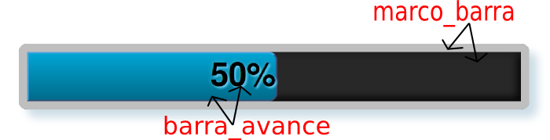
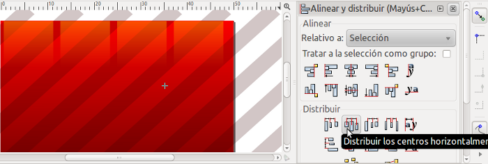
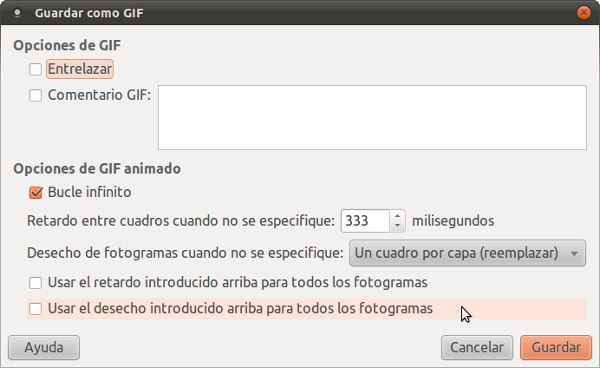
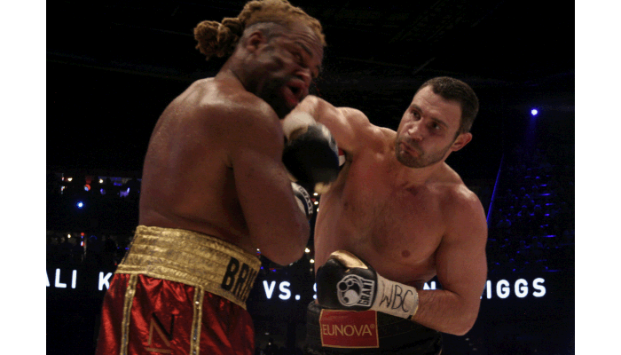

# Barras de proceso.

Hoy quiero platicar de las barras pero no de las barras que estas penzando `':-0` mas bien de las **barras de proceso CSS**.

Las barras de proceso, son una forma grafica de la representación de datos, estos datos en su mayoria se suelen representar de forma porcentual.

Por ejemplo si en un sistema tenemos 10 usuarios de los cuales 5 son administradores entonces tenemos un 50% de usuarios administradores, los cuales los podemos representar de la siguiente manera:

	
50%

Bien pues este pequeño manual consiste en explicar una metodologia que nos sirva en generar estas barras, al tiempo de generar discusión al respecto.

## Haciendo las barras con css

Personalmente considero que la mejor forma de hacerlo en con puro **css**. La barra de proceso anterior esta hecha con código **CSS** el cual se le asigno a 2 _divs_ de nuestro código **HTML** siguiente:

	

		
50%

	

Podemos ver que tenemos 2 divs, el primero es el contenedor el cual esta instanciado a la clase **marco\_barra**, el 2do es propiamente la barra el cual es contenida y pertenece a la clase **barra\_avance**, como lo podemos ver en la siguiente imagen.

Como podemo ver las clases:

 - **marco\_barra** Define la parte gris clara(borde redondeado),el fondo gris obsculo, las sombras del contorno del marco, entre otras cosas.
 
 - **barra\_avance** Define la barra de proceso es la parte del gradiente azul, al tiempo que define la tipografia que nos indica que va avanzado un 50%.

Bien ahora atienda al siguiente código **css**:

<pre><code><b>div.marco_barra</b>, .ui-progressbar {
	background: #282828;
	border: 5px solid #BFBFBF;
	width: 100%;
	height: 30px;
	padding: 0;
	/* trataremos de poner las esquinas redondeadas */
	-moz-border-radius: 5px;
	-webkit-border-radius: 5px;
	-o-border-radius: 5px;
	border-radius: 5px;
	/* trataremos de poner sombras tanto internamente como externamente del marco de la barra de proceso */
	-webkit-box-shadow:inset 2px 2px 5px #212121,inset -2px -2px 5px #000000,5px 5px 5px #CDDDE6;
	-moz-box-shadow:inset 2px 2px 5px #212121,inset -2px -2px 5px #000000,5px 5px 5px #CDDDE6;
	-ms-box-shadow:inset 2px 2px 5px #212121,inset -2px -2px 5px #000000,5px 5px 5px #CDDDE6;
	-o-box-shadow: inset 2px 2px 5px #212121,inset -2px -2px 5px #000000,5px 5px 5px #CDDDE6;
	box-shadow:inset 2px 2px 5px #212121,inset -2px -2px 5px #000000,5px 5px 5px #CDDDE6;
}
div.marco_barra <b>div.barra_avance</b>,
.ui-progressbar .ui-progressbar-value{
	height: 28px;
	/* agregamos el borde para que de un efecto de sobre-marco */
	border:1px solid #365077;
	border-top:1px solid #4BA3DE;
	border-left:1px solid #4BA3DE;
	/* trataremos de poner un fondo con un gradiente si no se puede lo pondra con un color solido */
	background: #00A5D4;
	background-repeat: repeat-x;
	background-image: -moz-linear-gradient(top, #00A5D4, #006C8B);
	background-image: -ms-linear-gradient(top, #FF5000, #003364);
	background-image: -webkit-gradient(linear, left top, left bottom, from(#FF5000), to(#003364));
	background-image: -webkit-linear-gradient(top, #FF5000, #003364);
	background-image: -o-linear-gradient(top, #FF5000, #003364);
	background-image: linear-gradient(top, #FF5000, #003364);
	filter: progid:DXImageTransform.Microsoft.gradient( startColorstr='#FF5000', endColorstr='#003364',GradientType=0 );
	/* trataremos de poner las esquinas redondeadas */
	-moz-border-radius:0 5px 5px 0;
	-webkit-border-radius:0 5px 5px 0;
	-o-border-radius:0 5px 5px 0;
	border-radius:0 5px 5px 0;
	/* Cuestiones relacionadas con la tipografia */
	color: #000;
	font-weight: bold;
	font-size: 20px;
	text-shadow: 1px 1px 1px #66CFED,-1px -1px 2px #23A1C5;
	text-align: right;
}</code></pre>

## Haciendo combinaciones(Combos).

Este codigo **css** intenta ser lo más **crossbrowser** posible, imaginemos que queremos poner las barras de en un espacio mas pequeño o quizas necesitamos barras de distintos colores, tratare de explicar como conseguir este comportamiento explicando el 1er caso, para esto vamos a definir dos clases la clase **mini** para el marco y la clase **mini** contenida dentro de otra clase **mini** como se puede ver en el siguiente codigo **HTML**:

	

		
50%

	

Los cambios necesarios como se puede ver en el siguiente código **CSS** que se le agregara al código antes mostrado:

	/* definicion para las barras minis */
	div.mini{
		border: 2px solid #BFBFBF;
		height: 20px;
	}

	div.mini div.mini{
		height: 18px;
		font-weight: bold;
		font-size: 1px;
		-moz-border-radius:0 4px 4px 0;
		-webkit-border-radius:0 4px 4px 0;
		-o-border-radius:0 4px 4px 0;
		border-radius:0 4px 4px 0;
	}

### Ressultado

    
50%

## Barra animada

Tomando esta logica podemos agregar tipos de barras como necesitemos, para esto vamos agregar una barra de color roja del tipo animada, esto lo haremos con una imagen **gif** que se va ir desplazando.

Para la barra animada lo primero que necesitamos es la imagen **gif** la puedes hacer con el [**inkscape**](http://inkscape.org/) y [**gimp**](http://www.gimp.org/), el hacer una animación en la barra es muy similar a un **sprite csss** solo que posteriormente tienes que generrar la imagen animada con el [**gimp**](http://www.gimp.org/)(adjunto los archivos).

Lo primero que tienes que hacer es una _distribucion uniforme_ sobre los elementos que necesitas como se puede ver en la siguiente imagen:

Posteriormente se exportan las imagenes base y con estas se genera una animacion con el [**gimp**](http://www.gimp.org/) en este caso seran 3 capaz generando con esto una animación con 3 transiciones cada una sera cambiada en un intervalo de 333 _milisegundos_.

### Ressultado

    
50%

## Agregando animación en JavaScript(nocaut)

Si queremos darle la animación de como se va uncrementando una barra usted lo primero que tiene que hacer es agregarle un identificador a la barra:

### Codigo HTML

	

		
50%

	

Posteriormente puede hacer una funcion que reciba 3 paramentros el:

 - **id** del elemento a animar
 - El **incremento** (ó decremento)
 - El **intervalo** de la transición(en milisegundos).

### Función animarBarra JavaScript:

Dejo aquí un ejemplo de la funcion la cual la puedes adaptar a tus necesidades:

	

### Llamada

En este caso vamos a llamar a la función para que nos anime el elemento con id **barra\_animada\_js**, donde deseamos un incremento de 10 cada 200milisegundos, como se muestra:

	

### Resultado

	
50%

## Finalizando con un frameWork!.

Finalmente este principio **css** es tambien empleado en la interfaz de usuario del **jQuery**, la unica diferencia es que:

 - La clase **marco_barra** es nombrada como **ui-progressbar**.
 - La clase **barra_avance** es nombrada como **ui-progressbar-value**.

Bien pues con esto y siguiendo la documentación de [**jQuery ui**](http://jqueryui.com/demos/progressbar/) podemos animar una barra con el siguiente código.

<a href="https://github.com/fitorec/manual_css_barras_de_proceso/downloads" class="get-code">Descargar Código fuente</a>  

## Conclusiones.

Sigiendo estos principios basicos de _css_ y _javascript_ podemos encontrar varios algunos proyectos como:

 - <http://jsullivan.github.com/CSS3-Progress-bars>
 - <http://jqueryui.com/demos/progressbar/>

Estos principios defienen buenas practicas sin embargo personalmente derrepente siento que nos genera codigo extra que muchas veces no lo necesitamos p.e. si en algun proyecto solo vamos a necesitar una unica clase de barra(con un unico comportamiento) entonces la mejor opción seria seguir estos principios y generar nuestro propio código _css_ y _javascript_(ó en su defecto quitar la '_paja extra_') lo cual hara más ligera la carga para nuestro navegador ademas que el tamaño de la descarga de nuestras librerias sera mucho menor.

##Comentarios.

>>Lo siento estoy buscando algun mecanismo de agregar comentarios en esta sección, pero me puedes comentar en [**@fitorec**](https://twitter.com/fitorec).

[img_table_dance]: img/table.jpg  "Barra - Table dance"
